# CredChain-LMS

**Blockchain-based credential verification system for digital learning platforms**

A decentralized micro-LMS credentialing solution built on Ethereum ERC-721 NFTs. Issuers mint tamper-proof credential tokens, learners hold them in their wallets, and employers verify authenticity through an intuitive React portal powered by ethers.js.

---

## 🎯 Problem Statement

Traditional digital learning platforms face critical challenges in credential verification:
- **Trust deficit**: Certificates can be forged or manipulated
- **Verification overhead**: Employers must manually contact institutions
- **Centralized control**: Single points of failure in credential databases
- **No learner ownership**: Credentials locked in proprietary platforms

CredChain-LMS solves these issues using blockchain technology to create immutable, verifiable, and learner-owned credentials.

---

## 🏗️ Architecture Overview


---

## 🔄 Credential Lifecycle Flow

```mermaid
sequenceDiagram
    participant Owner as Contract Owner
    participant Issuer as Educational Issuer
    participant Contract as CredentialNFT Contract
    participant Learner as Learner Wallet
    participant Employer as Employer/Verifier
    
    Note over Owner,Contract: Setup Phase
    Owner->>Contract: Deploy contract
    Owner->>Contract: setIssuer(issuerAddress, true)
    Contract-->>Owner: Issuer authorized
    
    Note over Issuer,Learner: Credential Minting Phase
    Issuer->>Issuer: Create credential JSON<br/>{course, module, learner, timestamp}
    Issuer->>Issuer: Compute credHash = keccak256(JSON)
    Issuer->>Contract: mintCredential(learner, credHash, tokenURI)
    Contract->>Contract: Validate issuer authorization
    Contract->>Contract: Mint ERC-721 NFT
    Contract->>Learner: Transfer NFT to learner wallet
    Contract-->>Issuer: Return tokenId
    
    Note over Learner: Credential Ownership
    Learner->>Learner: View credential in wallet
    Learner->>Learner: Display on portfolio/resume
    
    Note over Employer,Contract: Verification Phase
    Employer->>Contract: Query credential by tokenId
    Contract-->>Employer: Return {owner, issuer, credHash,<br/>issuedAt, revoked, tokenURI}
    Employer->>Employer: Obtain original JSON from learner
    Employer->>Employer: Compute hash of provided JSON
    Employer->>Employer: Compare computed hash with credHash
    
    alt Hash matches & not revoked
        Employer->>Employer: ✅ Credential verified & authentic
    else Hash mismatch or revoked
        Employer->>Employer: ❌ Credential invalid/tampered
    end
    
    Note over Issuer,Contract: Optional Revocation
    Issuer->>Contract: revokeCredential(tokenId)
    Contract->>Contract: Set revoked = true
    Contract-->>Issuer: Credential revoked
```



---

## 🛠️ Technology Stack

| Layer | Technology |
|-------|-----------|
| **Blockchain** | Ethereum (Sepolia/Goerli testnet) |
| **Smart Contract** | Solidity ^0.8.0 |
| **Token Standard** | ERC-721 (OpenZeppelin) |
| **Access Control** | Ownable pattern |
| **Frontend Framework** | React 18 (Create React App) |
| **Web3 Library** | ethers.js v6 |
| **Wallet Integration** | MetaMask |
| **Hash Function** | keccak256 (native Ethereum) |

---

## 📁 Project Structure

```
CredChain-LMS/
├── contracts/
│   └── CredentialNFT.sol          # ERC-721 smart contract
├── frontend/
│   ├── public/
│   │   └── index.html
│   ├── src/
│   │   ├── App.js                 # Main React component
│   │   ├── App.css                # Styling
│   │   ├── contract.js            # Contract ABI & address
│   │   └── index.js
│   └── package.json
├── scripts/                        # Deployment scripts (optional)
├── test/                          # Smart contract tests (optional)
├── hardhat.config.js              # Hardhat configuration (if using)
└── README.md
```

---

## 🚀 Quick Start Guide

### Prerequisites

- Node.js v16+ and npm
- MetaMask browser extension
- Testnet ETH (Sepolia faucet: https://sepoliafaucet.com)
- Solidity development environment (Hardhat/Remix/Foundry)

### Step 1: Deploy Smart Contract

#### Option A: Using Remix IDE (Easiest)

1. Open [Remix IDE](https://remix.ethereum.org)
2. Create `CredentialNFT.sol` and paste the contract code
3. Compile with Solidity 0.8.x
4. Deploy to Sepolia testnet via MetaMask
5. Copy deployed contract address

#### Option B: Using Hardhat

```bash
npm install --save-dev hardhat @openzeppelin/contracts
npx hardhat init

# Add contract to contracts/
npx hardhat compile

# Create deployment script in scripts/deploy.js
npx hardhat run scripts/deploy.js --network sepolia
```

### Step 2: Configure Frontend

```bash
cd frontend
npm install
```

Update `src/contract.js`:

```javascript
export const CONTRACT_ADDRESS = "0xYourDeployedContractAddress";

export const CONTRACT_ABI = [
  // Paste ABI from compilation artifacts
  "function mintCredential(address learner, bytes32 credHash, string memory tokenURI) external returns (uint256)",
  "function getCredential(uint256 tokenId) external view returns (address, address, bytes32, uint256, bool, string memory)",
  "function setIssuer(address account, bool allowed) external",
  "function revokeCredential(uint256 tokenId) external",
  // ... other functions
];
```

### Step 3: Launch Application

```bash
npm start
# Opens http://localhost:3000
```

---

## 📖 User Guide

### For Contract Owners (Admin)

1. **Connect Wallet**: Use the deployer account in MetaMask
2. **Navigate to Admin Tab**
3. **Authorize Issuers**:
   ```
   Issuer Address: 0x742d35Cc6634C0532925a3b844Bc9e7595f0bEb
   Allowed: ✓ True
   Click "Update Issuer"
   ```

### For Issuers (Educational Institutions)

1. **Connect Wallet**: Use authorized issuer account
2. **Navigate to Mint Tab**
3. **Fill Credential Details**:
   - Learner Address: `0x...` (student's wallet)
   - Course Name: "Smart Contract Development"
   - Module ID: "SC101"
   - Token URI (optional): `ipfs://...` or JSON metadata URL
4. **Click "Mint NFT"**
5. **Save tokenId** for learner records (e.g., `#42`)

### For Learners (Students)

- **View Credential**: Add contract address to MetaMask → NFTs section
- **Share Credential**: Provide `tokenId` to employers
- **Export Metadata**: Download original credential JSON for verification

### For Employers (Verifiers)

1. **Navigate to Verify Tab**
2. **Enter tokenId**: `42`
3. **Review On-Chain Data**:
   - ✅ Current Owner (learner address)
   - ✅ Issuer (institution address)
   - ✅ Credential Hash
   - ✅ Issuance Timestamp
   - ✅ Revocation Status
4. **Integrity Check** (Optional):
   - Obtain original JSON from learner
   - Paste JSON in verification box
   - Click "Check Hash"
   - System compares computed hash with on-chain `credHash`

---

## 🔐 Credential Hash Format

### Structure

```json
{
  "course": "Blockchain Fundamentals",
  "moduleId": "BF202",
  "learner": "0x742d35Cc6634C0532925a3b844Bc9e7595f0bEb",
  "issuer": "0x1234567890abcdef1234567890abcdef12345678",
  "issuedAt": "2025-01-15T10:30:00.000Z"
}
```

### Hash Computation

```javascript
// Frontend implementation
const credentialMeta = {
  course: courseName,
  moduleId: moduleId,
  learner: learnerAddress,
  issuer: issuerAddress,
  issuedAt: new Date().toISOString()
};

const jsonString = JSON.stringify(credentialMeta);
const credHash = ethers.keccak256(ethers.toUtf8Bytes(jsonString));
```

**⚠️ Critical Note**: JSON string must be **byte-identical** for hash verification. Whitespace, key ordering, and encoding must match exactly.

---

## 🔒 Security Considerations

### What This System Provides

✅ **Immutability**: Credential data cannot be altered after minting  
✅ **Authenticity**: Cryptographic proof of issuer identity  
✅ **Integrity**: Tamper-evidence via hash verification  
✅ **Decentralization**: No central authority controls credentials  
✅ **Learner Ownership**: Credentials live in user wallets  

### Known Limitations (MVP Scope)

⚠️ **Privacy**: On-chain hashes are public (metadata in tokenURI may leak info)  
⚠️ **Key Management**: Lost private keys = lost credentials  
⚠️ **Gas Costs**: Minting requires transaction fees  
⚠️ **Revocation Model**: Soft revocation (flag-based, not burning)  
⚠️ **Transferability**: NFTs are transferable by default (not soulbound)  

### Recommended Enhancements for Production

- Implement **Soulbound Tokens** (non-transferable)
- Add **zero-knowledge proofs** for selective disclosure
- Integrate **IPFS** for decentralized metadata storage
- Build **multi-signature** minting for institutional approval workflows
- Add **batch minting** for efficiency
- Implement **expiration dates** for time-limited certifications

---

## 🧪 Testing & Development

### Local Testing with Hardhat

```bash
# Install dependencies
npm install --save-dev @nomiclabs/hardhat-ethers ethers @openzeppelin/contracts

# Run local blockchain
npx hardhat node

# Deploy to local network
npx hardhat run scripts/deploy.js --network localhost

# Run tests
npx hardhat test
```

### Example Test Suite

```javascript
describe("CredentialNFT", function () {
  it("Should mint credential with correct hash", async function () {
    const [owner, issuer, learner] = await ethers.getSigners();
    
    // Deploy contract
    const CredentialNFT = await ethers.getContractFactory("CredentialNFT");
    const contract = await CredentialNFT.deploy("CredChain", "CRED");
    
    // Authorize issuer
    await contract.setIssuer(issuer.address, true);
    
    // Create credential
    const meta = {
      course: "Test Course",
      moduleId: "TC001",
      learner: learner.address,
      issuer: issuer.address,
      issuedAt: new Date().toISOString()
    };
    const credHash = ethers.keccak256(ethers.toUtf8Bytes(JSON.stringify(meta)));
    
    // Mint
    await contract.connect(issuer).mintCredential(learner.address, credHash, "");
    
    // Verify
    const [owner, issuerAddr, hash] = await contract.getCredential(1);
    expect(owner).to.equal(learner.address);
    expect(hash).to.equal(credHash);
  });
});
```

---

## 🌐 Deployment Checklist

- [ ] Smart contract audited (if production)
- [ ] Deployed to target network (Sepolia/Mainnet)
- [ ] Contract verified on Etherscan
- [ ] Frontend environment variables configured
- [ ] IPFS/metadata storage tested
- [ ] Multi-issuer authorization configured
- [ ] Emergency pause mechanism tested (if implemented)
- [ ] Gas optimization reviewed
- [ ] User documentation finalized
- [ ] Support/feedback channels established

---

## 🤝 Contributing

We welcome contributions! Areas for improvement:

- **Smart Contract**: Add batch minting, expiration logic, credential templates
- **Frontend**: Improve UX, add credential history, wallet connect alternatives
- **Testing**: Expand test coverage, add integration tests
- **Documentation**: Tutorials, video guides, API documentation
- **Integrations**: LMS platform connectors, LinkedIn integration

### Development Workflow

1. Fork the repository
2. Create feature branch (`git checkout -b feature/AmazingFeature`)
3. Commit changes (`git commit -m 'Add AmazingFeature'`)
4. Push to branch (`git push origin feature/AmazingFeature`)
5. Open Pull Request

---

## 📚 Related Research

This project implements concepts from academic research on blockchain-based credentialing for digital learning platforms, specifically exploring:

- Decentralized identity for learners
- Immutable skill verification records
- Trust models for entrepreneurial education
- Hybrid learning system architectures

**Reference**: Blockchain credentialing frameworks for entrepreneurial skill development in digital learning environments.

---


---

## 🎓 Educational Use Cases

1. **University Degree Verification**: Tamper-proof diploma NFTs
2. **Online Course Completion**: Coursera/Udemy-style certificates
3. **Corporate Training**: Employee skill badges
4. **Professional Certifications**: CPA, PMP, AWS certifications
5. **Micro-credentials**: Single skill/module attestations
6. **Continuing Education**: CME credits for healthcare professionals

---

## 🏆 Acknowledgments

- **OpenZeppelin**: Secure smart contract libraries
- **Ethereum Foundation**: Blockchain infrastructure
- **MetaMask**: Wallet integration
- **Create React App**: Frontend boilerplate
- **Research Community**: Inspiration from academic blockchain credentialing papers

---

## 📊 Project Statistics


---


*Empowering learners with verifiable, portable, blockchain-based credentials*
